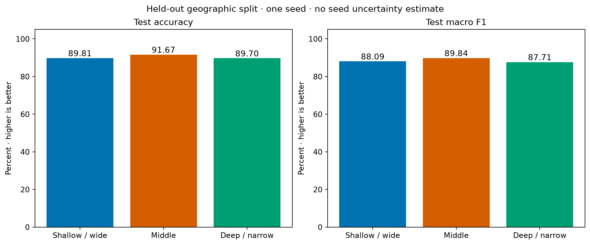
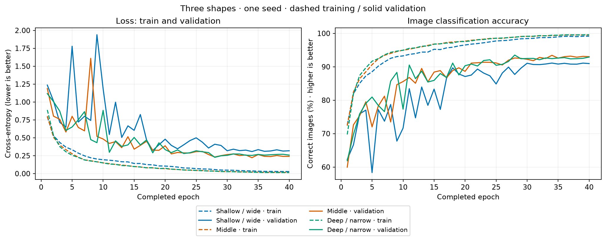
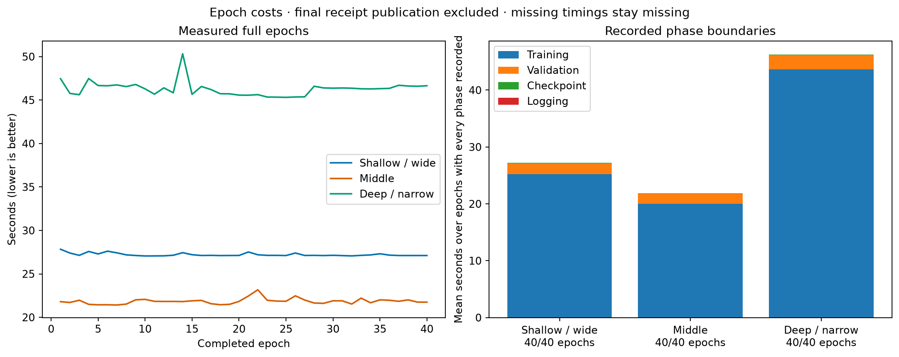
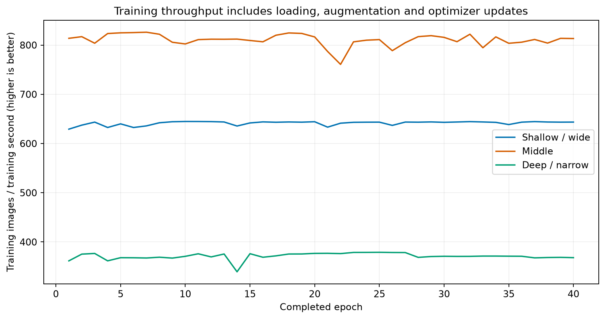
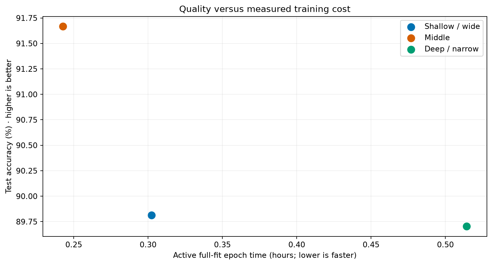
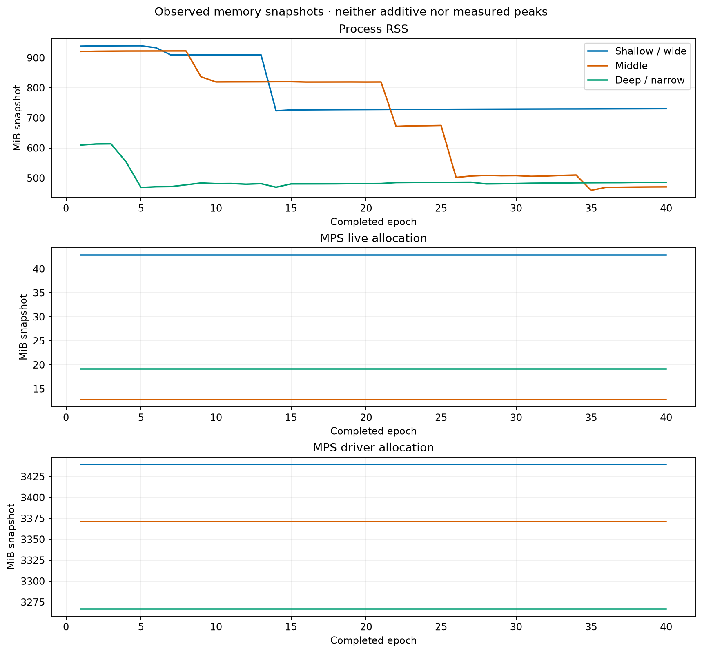
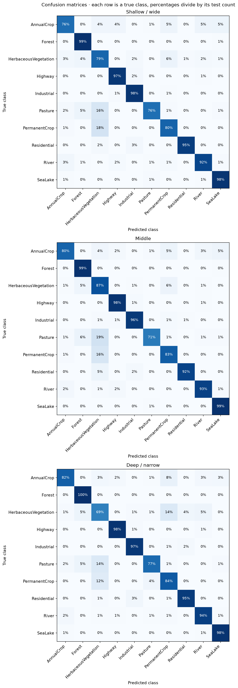

# Width versus depth on EuroSAT RGB

**Completed experiment:** `run_001` · protocol `eurosat-width-depth-v3` · 23 September 2026 · seed `42` · PyTorch/MPS

The middle residual CNN achieved the highest observed test accuracy, **91.67%**, and the shortest measured training time, **14.57 minutes**. The three models contained approximately 0.70 million parameters each. The deeper model needed **2.12×** the middle model's training time and scored 89.70% on the test partition. The shallow model had the lowest measured single-image inference latency, so the preferred shape depends on the workload.

These are observations from **one seed and one training recipe**, not evidence that one depth is universally best. This report separates measured results from possible explanations and links to the saved evidence.

## Question and experimental controls

> At approximately equal parameter counts, how does residual-CNN width versus depth affect satellite-image classification quality and execution cost?

The comparison changes the number of residual blocks and channel widths. It keeps the data partitions, input resolution, augmentation, optimizer, epoch budget, seed and checkpoint-selection rule fixed. All models start from fresh weights; no pretrained model or hyperparameter search is used.

### Dataset and split

EuroSAT contains labeled Sentinel-2 satellite patches spanning ten land-cover classes. This experiment uses the RGB archive, with all **27,000 images at their native 64 × 64 resolution**. Dataset attribution belongs to Helber, Bischke, Dengel and Borth; see the [EuroSAT authors' repository](https://github.com/phelber/EuroSAT) and [dataset release](https://zenodo.org/records/7711810).

The project applies the published longitude-based **EuroSATSpatial** manifests to the RGB filenames, rather than drawing a random image split. The manifests are pinned to revision `1ce6f1bfb56db63fd91b6ecc466ea67f2509774c`; their individual checksums and the archive checksum are preserved in the [dataset manifest](../results/run_001/provenance/dataset.json). The split methodology is documented by [TorchGeo](https://docs.torchgeo.org/en/stable/api/datasets/eurosat.html).

| Partition | Images | Use |
| --- | ---: | --- |
| Training | 16,200 | Weight updates and fitted RGB normalization |
| Validation | 5,400 | Checkpoint selection and inference timing requests |
| Test | 5,400 | Evaluation after all three checkpoints were frozen |

Images are cached as uint8 arrays. After division by 255, each channel is normalized using **training pixels only**: RGB means `(0.36446, 0.39303, 0.41677)` and standard deviations `(0.20714, 0.13470, 0.11605)`. Independent horizontal and vertical flips augment training batches; validation and test inputs receive no random augmentation.

The spatial partitions have different class proportions. For example, validation/test contain 330/816 HerbaceousVegetation images, 394/818 AnnualCrop images and 1,289/736 SeaLake images. This matters when interpreting validation-to-test changes. Longitude partitioning does not establish a geographic buffer or complete spatial independence.

### Architecture matching

Each network has a 3 × 3 stem, three residual stages, BatchNorm and ReLU, global average pooling and a ten-class linear head. Stage transitions downsample spatial dimensions while doubling channel width. Each basic residual block has two 3 × 3 convolutions; projection shortcuts handle stage transitions.

| Shape | Blocks per stage | Stage widths | Main-path convolutions¹ | Parameters |
| --- | ---: | --- | ---: | ---: |
| Shallow / wide | 1 | 48 / 96 / 192 | 7 | 691,834 |
| Middle | 2 | 32 / 64 / 128 | 13 | 696,618 |
| Deep / narrow | 4 | 22 / 44 / 88 | 25 | 697,344 |

¹ Includes the stem and the two convolutions in every residual block; excludes the two projection-shortcut convolutions and the classifier.

Parameter spread is `(697,344 − 691,834) / 691,834 = 0.796%`, below the 5% acceptance limit. Learned BatchNorm parameters and the classifier are included; running-statistic buffers are not trainable parameters. Exact summaries are preserved for [shallow](../results/run_001/training/shallow_wide/architecture.json), [middle](../results/run_001/training/middle/architecture.json) and [deep](../results/run_001/training/deep_narrow/architecture.json).

Approximately matching parameter counts does **not** match arithmetic cost, receptive field, activation memory, optimization difficulty or effective regularization.

### Training and selection

| Setting | Executed value |
| --- | --- |
| Fits | Three shapes × one seed (`42`) |
| Duration | 40 epochs per fit; no early stopping |
| Optimizer | AdamW, learning rate `1e-3`, weight decay `1e-4` |
| Schedule | Cosine decay toward `1e-5` |
| Loss | Mean multiclass cross-entropy |
| Batch sizes | Training 128; validation 256 |
| Gradient clipping | Global norm 1.0 |
| Precision and backend | FP32 on Apple MPS |
| Data-loader workers | 0 |
| Checkpoint selection | Highest validation accuracy, then lowest validation cross-entropy, then earliest epoch |

The same example-order seed is used for corresponding fits. It does not give differently shaped networks identical initial weights. All three validation-selected checkpoints were frozen before test evaluation. The executed settings and checkpoint hashes are in the [configuration](../results/run_001/provenance/config.json) and [selection receipt](../results/run_001/provenance/selection.json).

## Observed classification results

Accuracy is correct predictions divided by all 5,400 test images. Macro F1 gives each of the ten class-level F1 scores equal weight. Higher is better for both; lower cross-entropy is better. No seed uncertainty bars are reported because there is only one seed.

| Shape | Selected epoch | Selected validation accuracy | Test accuracy | Test macro F1 | Test cross-entropy | Test errors |
| --- | ---: | ---: | ---: | ---: | ---: | ---: |
| Shallow / wide | 34 | 91.11% | 89.81% | 0.8809 | 0.3765 | 550 |
| Middle | 34 | 93.43% | **91.67%** | **0.8984** | **0.2983** | **450** |
| Deep / narrow | 28 | **93.50%** | 89.70% | 0.8771 | 0.3872 | 556 |

Middle correctly classifies **100 more test images than shallow** and **106 more than deep**. Deep's validation lead over middle is only four images, or 0.074 percentage points. Its larger test drop does not establish a general rule about depth: these partitions differ geographically and in class composition, and training-seed variation was not measured.

The training-majority baseline predicts Residential for every image and obtains **9.39% test accuracy**. This is a deliberately simple reference, determined from training labels; it is not a competitive image-classification model.

The [quality table](../results/run_001/tables/quality.csv) and per-model [shallow](../results/run_001/evaluation/shallow_wide/metrics.json), [middle](../results/run_001/evaluation/middle/metrics.json) and [deep](../results/run_001/evaluation/deep_narrow/metrics.json) records contain unrounded values and checkpoint identities.

### Learning trajectories

All three models learn: the final logged training accuracies are 99.15%, 99.52% and 99.59% for shallow, middle and deep respectively. Validation performance settles below these values. The training metric includes augmented images and weights that change during an epoch, so this gap is descriptive rather than a comparison of identical evaluation conditions.

- Shallow's best validation accuracy through epoch 30 is 91.06%; its eventual best at epoch 34 is 91.11%, a gain of three validation images.
- Middle's best through epoch 30 is 92.63%; its best at epoch 34 is 93.43%, a gain of 43 validation images.
- Deep peaks at epoch 28. Its last five validation accuracies range from 92.37% to 92.91%, below the selected 93.50%.

Training loss keeps declining while late validation gains are limited. These logs support retaining the validation-selected weights; they do not provide a clear reason to extend the epoch budget automatically. The observed later-epoch behavior also does not prove a particular cause such as excessive capacity or geographic domain shift.

All 120 completed epoch rows are available in the [epoch table](../results/run_001/tables/epochs.csv).

## Execution cost

### Training

All 40 epochs of every fit have final timing receipts. Their sums cover training, validation, checkpoint persistence and epoch logging, with the boundary ending before final receipt/table/TensorBoard timing-series publication. They exclude data preparation, notebook idle time, test evaluation and inference benchmarks. They are not the notebook's complete elapsed duration.

| Shape | Median epoch | Sum of 40 recorded epochs | Median training throughput |
| --- | ---: | ---: | ---: |
| Shallow / wide | 27.13 s | 18.14 min | 643.4 images/s |
| Middle | **21.84 s** | **14.57 min** | **811.9 images/s** |
| Deep / narrow | 46.33 s | 30.86 min | 371.0 images/s |

The combined recorded epoch time is **63.57 minutes**. Middle uses 19.7% less time than shallow; deep uses 2.12× middle's time. Across shapes, training accounts for 91.5–94.3% of recorded epoch time and validation for 5.5–8.2%. Checkpointing plus logging accounts for at most 0.31%, so removing those records would not materially reduce this run's cost.

### Inference

Each selected model is measured on identical saved validation requests, using five warm-ups followed by 30 timed requests at batch sizes 1 and 64. Accelerator synchronization bounds each measurement. Timings cover the **FP32 model forward pass only**; image loading, normalization, device transfer and prediction formatting are outside the boundary. Throughput is total images divided by total measured request time, rather than the reciprocal of median latency.

| Shape | Batch | Request p50 | Request p95 | Images/s |
| --- | ---: | ---: | ---: | ---: |
| Shallow / wide | 1 | **2.281 ms** | **2.909 ms** | **421.7** |
| Middle | 1 | 2.994 ms | 3.996 ms | 321.7 |
| Deep / narrow | 1 | 4.687 ms | 5.430 ms | 213.0 |
| Shallow / wide | 64 | 24.347 ms | 24.827 ms | 2,620.9 |
| Middle | 64 | **23.500 ms** | **24.219 ms** | **2,709.9** |
| Deep / narrow | 64 | 32.134 ms | 32.817 ms | 1,984.2 |

Shallow is the lowest-latency option in the measured single-image case. Middle has the best observed batch-64 throughput, but its small lead over shallow should not be treated as a stable hardware speedup: this is one bounded measurement block per model, in sequential model order, without repeated-block uncertainty estimates.

The panels are fixed workloads rather than representative deployment traffic: the batch-1 panel contains 30 PermanentCrop images, while the batch-64 panel contains 1,920 unique images across five classes. Shapes receive exactly the same requests. The [request list](../results/run_001/benchmarks/middle/requests.json), [raw middle latencies](../results/run_001/benchmarks/middle/latencies.csv) and all three [shallow](../results/run_001/benchmarks/shallow_wide/summary.json), [middle](../results/run_001/benchmarks/middle/summary.json) and [deep](../results/run_001/benchmarks/deep_narrow/summary.json) summaries preserve the measurement boundaries and identities.

Process RSS, MPS live allocation and MPS driver allocation are **separate snapshots**, not additive quantities or measured peaks. Allocator state and earlier work can affect them. They cannot establish the minimum memory needed for training or remaining GPU compute capacity.

## Failure analysis from saved predictions

The following analysis uses prediction IDs, labels, confidence values and confusion counts. **It does not constitute a visual review of failure images**, and no label-error claim is made.

The clearest difference is HerbaceousVegetation. Deep correctly classifies 562 of 816 images, compared with middle's 712: **68.87% versus 87.25% recall**. Deep sends 113 HerbaceousVegetation images to PermanentCrop, versus middle's 45. Across all other classes combined, deep recovers 44 correct predictions relative to middle, leaving an overall deficit of 106 images.

| Class | Test support | Shallow F1 | Middle F1 | Deep F1 |
| --- | ---: | ---: | ---: | ---: |
| HerbaceousVegetation | 816 | 0.8174 | 0.8553 | 0.7693 |
| PermanentCrop | 307 | 0.7569 | 0.7744 | 0.6853 |
| Pasture | 115 | 0.7803 | 0.7593 | 0.7574 |

Pasture has the smallest test support. Its percentages are based on only 115 images; a small change in image count moves recall noticeably. Middle improves the overall result without winning every class, as the table illustrates. Full support, precision, recall and F1 values are retained in the per-class tables for [shallow](../results/run_001/evaluation/shallow_wide/per_class.csv), [middle](../results/run_001/evaluation/middle/per_class.csv) and [deep](../results/run_001/evaluation/deep_narrow/per_class.csv).

Joining the three prediction files by sample ID gives **253 images misclassified by all three models**. Of those, 191 receive the same wrong class from all three. Common errors include 98 AnnualCrop, 73 HerbaceousVegetation, 28 PermanentCrop and 20 Pasture images. These are useful candidates for a later image-level review, but agreement among models does not establish that a reference label is wrong.

Middle makes 115 incorrect predictions with softmax confidence at least 95%, including 64 at least 99%. Examples in the saved records include `AnnualCrop_1114.jpg` predicted as SeaLake and `Pasture_889.jpg` predicted as Forest. High confidence is not established reliability; calibration was not evaluated. The [highest-confidence mistake table](../results/run_001/tables/failure_review.csv) is a deliberately selected diagnostic sample, while the [complete middle predictions](../results/run_001/evaluation/middle/predictions.csv) retain all 5,400 observations. Neither the selected examples nor the error analysis should be used to retune against this test set.

## Interpretation and limitations

**Observed:** the middle shape provides the strongest test-quality/training-time trade-off in this run. Shallow has lower single-image inference latency. Deep's nearly tied validation result does not transfer into superior test performance.

**Possible explanations, not established mechanisms:** channel dimensions and serial depth can interact differently with MPS kernels; changing depth also changes receptive field and optimization behavior. Geographic and class-composition differences may contribute to the validation/test reversal. This comparison does not isolate those explanations, measure GPU kernel occupancy or prove that depth caused a particular error type.

The evidence is limited to one seed, one fixed recipe, three compact residual CNNs, this RGB spatial partition and one MPS machine. There are no repeated-seed estimates or statistical-superiority claims. The data cover ten satellite land-cover classes, not arbitrary photographs or multispectral inference. The spatial split is more specific than a random-image benchmark and is not directly comparable with published results that use another split, training policy or architecture. Future experiments informed by this analysis would be exploratory; this already-inspected test set would not become a fresh confirmation set.

## Reproducibility and validation status

The run used Python **3.13.15**, PyTorch **2.13.0**, FP32 and the MPS backend. Exact package and platform versions are preserved in the [environment record](../results/run_001/provenance/environment.json). The [run identity](../results/run_001/provenance/identity.json), [source manifest](../results/run_001/provenance/source_manifest.json), [dataset manifest](../results/run_001/provenance/dataset.json) and [selection receipt](../results/run_001/provenance/selection.json) bind source, configuration, preprocessing and selected checkpoint hashes.

The implementation provides explicit run selection, filesystem writer locks, atomic checkpoint commits and recovery of optimizer, scheduler, RNG and data-loader generator state. **This run did not empirically exercise interrupted recovery:** each fit records one completed attempt beginning before epoch one. See the attempt records for [shallow](../results/run_001/training/shallow_wide/attempts.json), [middle](../results/run_001/training/middle/attempts.json) and [deep](../results/run_001/training/deep_narrow/attempts.json).

Dataset preparation, all three 40-epoch fits, checkpoint selection, test evaluation and the bounded inference benchmarks were executed. Standalone tests were authored but **have not been executed as part of this study**. Successful experiment execution is evidence for these exercised paths, not proof that every recovery, corruption or edge-case test passes.

The curated results preserve numerical evidence, readable figures and provenance. Dataset arrays, checkpoints and transient logs are omitted from the GitHub-facing bundle; checkpoint hashes remain available for matching a retained local run. Re-running the notebook creates a new experiment rather than reproducing these measurements by loading hidden historical weights.
